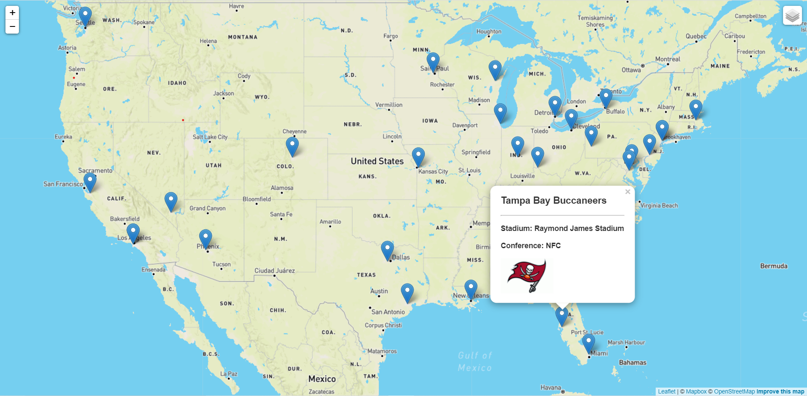

## NFL STADIUM LOCATIONS - GeoJSON of American Football Stadiums

With geojson data retrieved from https://github.com/sisskind/GeoJSON-Football/blob/master/stadiums.geojson, which has coordinates for all the NFL stadiums I used Leaflet to create a map to show the locations of all current NFL stadiums. However, since the data was last updated in 2017, a local copy was created and updated to reflect the current information on the teams as well as the stadiums. An image folder containing all the logos of the NFL teams was used to add team logos to the popups on the maps. 

Since the logo images were not stored as part of the dataset used, I created a function "getImage" which also has embedded conditional statements to assign each team their respective logo from an image folder. This was then appended to the popups as an image source. 

Users will however notice that teams which share stadiums such as L.A. Rams and L.A. Chargers (SoFi Stadium) and NY Jets and NY Giants (MetLife Stadium) have the logos of both teams in their respective popups. 

The map has three (3) base layers; Street Map, Dark Map and a Satelite Map. With a collapsible control panel, users can pick which layer they want to view. The popups show important information on the team/teams that play in these stadiums, Stadium name, Conference as well as the Team logo. 

